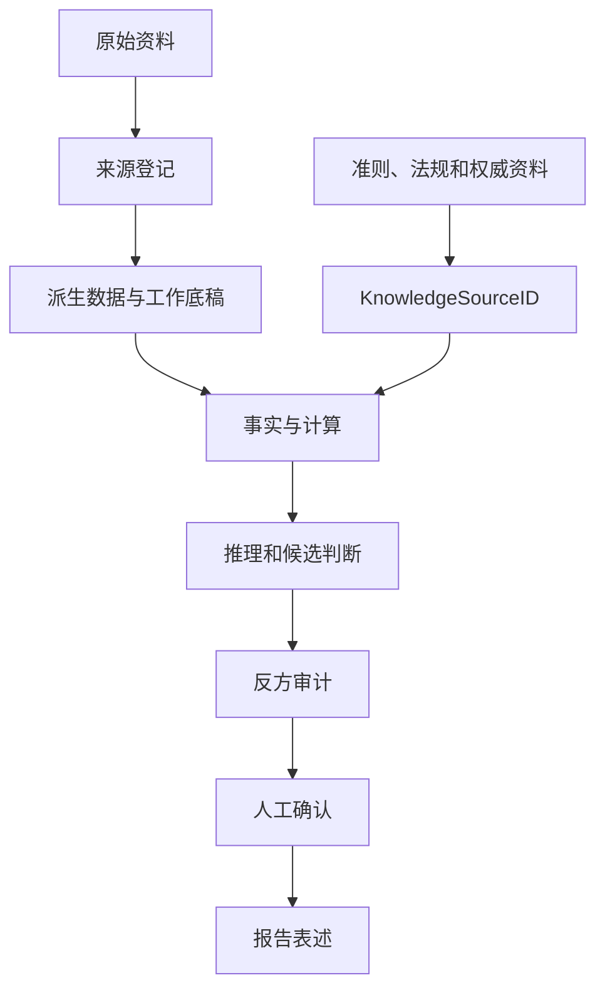

# 方法架构

## 1. 总体分层

FDD AutoSYS 将财务尽调拆分为相互连接但职责清晰的七层。

| 层级 | 主要职责 | 典型输出 |
| --- | --- | --- |
| 项目入口 | 登记范围、主体、期间、交易口径和资料 | 项目状态、来源登记 |
| Phase -1 | 快速识别业务模式和尽调优先级 | 经营画像、策略备忘录 |
| 证据层 | 保存项目事实和权威依据的追踪关系 | SourceID、KnowledgeSourceID |
| 专题分析 | 按当前问题加载单张方法卡 | 分析步骤、证据缺口、候选判断 |
| 工作底稿 | 保存数据、计算、公式和引用位置 | 工作底稿、问题清单 |
| 复核与人工门 | 反方审计、重大判断确认 | 复核意见、Human Gate记录 |
| 交付层 | 形成面向人的阶段摘要和报告草案 | 阶段摘要、FDD报告草案 |

## 2. 四角色模型

| 角色 | 主要职责 | 不得越过的边界 |
| --- | --- | --- |
| `lead_agent` | 策略、任务编排、复杂判断、证据链和报告主线 | 不以自审替代独立复核或人工确认 |
| `worker_agent` | 批量提取、整理、计算、初筛和格式化 | 不关闭重大判断 |
| `review_agent` | 寻找替代解释、反证、证据断点和过度表述 | 不代替项目负责人最终确认 |
| `human` | 范围、口径、重要性、重大问题和正式报告确认 | 对最终专业结论负责 |

重大事项采用：

```text
lead_agent初判 → review_agent反方审计 → lead_agent复核 → Human Gate
```

## 3. 渐进式调用

框架不在项目启动时加载全部能力，而是按任务逐层展开：

1. 加载项目规则和当前状态；
2. 执行Phase -1经营画像；
3. 确定一个主专题；
4. 只读取对应方法卡；
5. 需要自动保障时再调用开发工具；
6. 需要第二专题时显式切换，避免隐式扩张范围。

这种结构降低普通项目的上下文和依赖负担，也让每次分析更容易复核。

## 4. 证据流



报告数字应能够回溯至工作底稿、具体位置和原始来源。准则或法规首次用于专业判断时，应同时给出发布机关、文件全名、文号、适用期间、具体条款和官方来源。

## 5. 两层记忆

### 项目工作记忆

只服务单个目标企业，记录用户输入、项目资料、Phase -1判断和后续证据。发现后续事实与初始画像存在重大偏差时，应在对话中向用户报告。

### 受控跨项目记忆

只保存经过脱敏、证据核验和人工批准的可复用方法。项目工作记忆不会自动进入跨项目正式记忆。

## 6. 发布画像

- **普通项目包**：面向财务尽调使用者，保持轻量和渐进式调用，不要求Python。
- **开发全套包**：保存canonical规则、测试、构建器和严格验证工具。
- **可选保障层**：按需要运行自动校验、黄金样本和发布检查；未运行时必须明确记录。
